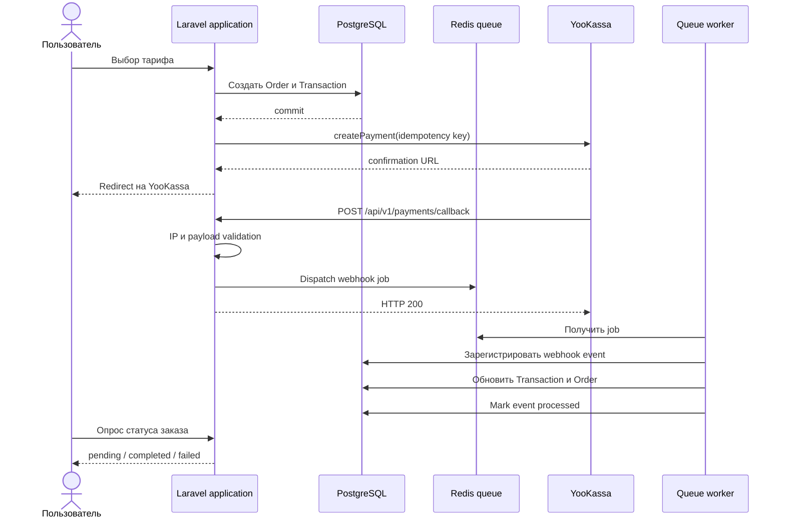

# Payment System

Демонстрационный платёжный сервис на Laravel и Vue с интеграцией YooKassa. Проект показывает полный пользовательский сценарий: регистрация, аутентификация, выбор тарифа, создание платежа, асинхронная обработка webhook, повторная доставка событий и история транзакций.

> Проект предназначен для технической демонстрации на собеседовании. YooKassa работает в тестовом режиме, а production-ограничения и точки дальнейшего развития описаны в разделе [Ограничения demo](#ограничения-demo).

## Возможности

- Laravel 13, PHP 8.5 и PostgreSQL.
- Vue 3, Inertia.js, TypeScript, Vite и Tailwind CSS.
- Регистрация, вход, подтверждение email, восстановление пароля и 2FA.
- Три тарифных плана с серверной валидацией выбранного плана.
- Создание платежа через YooKassa с idempotency key.
- Webhook endpoint с проверкой IP YooKassa, суммы, валюты, transaction metadata и gateway payment ID.
- Асинхронная обработка webhook через Redis queue.
- Retry/backoff для webhook job и фиксация статуса обработки события.
- Идемпотентность webhook по паре `gateway_payment_id + event_type`.
- State machine для статусов заказов и транзакций.
- Проверка pending-платежей по расписанию и очистка старых webhook-событий.
- Docker Compose с Nginx, PHP-FPM, PostgreSQL, Redis, queue worker и scheduler.
- PHPStan, Pint, ESLint, Prettier, TypeScript checks и Pest.

## Быстрый запуск

### Требования

- Docker Engine 24+ и Docker Compose v2.
- Доступ к тестовому магазину YooKassa, если требуется пройти полный сценарий оплаты.
- Свободные порты, указанные в `.env`.

### 1. Клонировать проект и подготовить окружение

```bash
git clone <repository-url>
cd payment-system
cp .env.example .env
```

Для Windows/PowerShell:

```powershell
Copy-Item .env.example .env
```

Откройте `.env` и задайте минимум:

```dotenv
APP_NAME="Payment System"
APP_URL=http://localhost:8465
APP_DEBUG=false

DB_PASSWORD=change-me
REDIS_PASSWORD=change-me

YOOKASSA_SHOP_ID=your_shop_id
YOOKASSA_SHOP_KEY=your_secret_key
NGROK_AUTHTOKEN=your_ngrok_token
```

Для локального просмотра можно оставить `APP_DEBUG=true`. Для публичного VPS demo используйте `APP_DEBUG=false` и HTTPS.

### 2. Собрать и запустить контейнеры

```bash
docker compose up -d --build
```

Проверить состояние сервисов:

```bash
docker compose ps
docker compose logs -f app supervisor_worker scheduler
```

### 3. Установить зависимости и подготовить приложение

```bash
docker compose exec app composer install --no-interaction
docker compose exec app npm install
docker compose exec app php artisan key:generate
docker compose exec app php artisan migrate --force
docker compose exec app php artisan ziggy:generate --types
docker compose exec app npm run build
```

Проверить доступность приложения:

```text
http://localhost:8465
```

Проверить health endpoint:

```text
http://localhost:8465/up
```

Порт задаётся переменной `NGINX_PORT` в `.env`.

### 4. Настроить webhook YooKassa

Для локальной демонстрации можно использовать сервис `ngrok` из Compose:

```bash
docker compose logs -f ngrok
```

Откройте URL ngrok и задайте в кабинете YooKassa endpoint:

```text
https://<ngrok-domain>/api/v1/payments/callback
```

Для VPS укажите публичный HTTPS URL:

```text
https://<your-domain>/api/v1/payments/callback
```

В текущем demo whitelist IP YooKassa настроен в `YookassaIpWhitelist`. Перед production-использованием список сетей должен поддерживаться через конфигурацию и регулярно проверяться по актуальной документации YooKassa.

## Использование

1. Откройте главную страницу приложения.
2. Зарегистрируйте пользователя или войдите в существующий аккаунт.
3. Перейдите в раздел Billing.
4. Выберите тариф.
5. Нажмите кнопку оплаты и перейдите на страницу YooKassa.
6. Завершите оплату тестовой картой YooKassa.
7. После возврата в приложение откройте страницу обработки платежа.
8. Статус заказа обновится после webhook и обработки queue job.
9. В Billing Dashboard доступны заказы, попытки оплаты, статусы транзакций и диагностический поток событий.
10. Для заказа в статусе `pending` или `failed` доступна повторная попытка оплаты.

Суммы и названия тарифов находятся в `config/plans.php`. Выбранный `plan_id` дополнительно проверяется на backend в `InitiateRequest`, поэтому изменение данных в браузере не позволяет произвольно назначить цену.

## Архитектура платежа



### Основные компоненты

| Зона | Реализация |
| --- | --- |
| HTTP/API | `routes/web.php`, `routes/api.php`, controllers и Form Requests |
| Платёжный gateway | `app/Services/Payments/Gateways/YookassaGateway.php` |
| Бизнес-логика транзакций | `app/Services/Transactions/YooKassaTransactionService.php` |
| Асинхронный webhook | `app/Jobs/ProcessYooKassaWebhookJob.php` |
| Идемпотентность | `transaction_webhook_events` и unique constraint |
| Состояния | `OrderStatus`, `TransactionStatus`, `HasStateMachine` |
| Периодическая сверка | `payments:check-pending-payments` |
| Очистка событий | `payments:destroy-old-webhook-events` |
| Frontend | `resources/js/pages/Billing` и `resources/js/components` |

### Статусы

Заказ:

```text
pending -> completed
pending -> failed
```

Транзакция:

```text
pending -> waiting_for_capture -> succeeded -> refunded
pending -> succeeded
pending -> canceled
waiting_for_capture -> canceled
```

Переходы контролируются enum-ами и `HasStateMachine`. Повторная доставка уже обработанного webhook не должна повторно менять состояние заказа.

## Тесты и проверки качества

Основные команды запускаются внутри `app` контейнера:

```bash
# PHPUnit/Pest
docker compose exec app php artisan test

# PHP formatting check
docker compose exec app composer lint:check

# PHPStan
docker compose exec app composer types:check

# ESLint
docker compose exec app npm run lint:check

# Prettier
docker compose exec app npm run format:check

# Полная проверка из composer
docker compose exec app composer ci:check
```

Для платёжного домена особенно важны тесты на:

- успешный `payment.succeeded`;
- повторную доставку одного webhook;
- retry после неудачной обработки webhook;
- несоответствие суммы или валюты;
- неизвестную транзакцию;
- невозможный переход статуса;
- конкурентную обработку webhook и scheduler;
- повторную оплату failed-заказа.

## Наблюдаемость и эксплуатация

Логи приложения находятся в `storage/logs`. Платёжные события пишутся в отдельный канал `payments`.

Полезные команды:

```bash
docker compose logs -f supervisor_worker
docker compose logs -f scheduler
docker compose exec app php artisan queue:failed
docker compose exec app php artisan queue:retry all
docker compose exec app php artisan payments:check-pending-payments
docker compose exec app php artisan payments:destroy-old-webhook-events
```

Scheduler запускает:

- проверку pending-платежей каждые 10 минут;
- удаление старых webhook-событий каждые 6 часов.

## Безопасность

- Секреты YooKassa не должны попадать в Git и README.
- В публичном demo необходимо отключить `APP_DEBUG`.
- Для VPS рекомендуется HTTPS через Nginx и Let's Encrypt.
- PostgreSQL и Redis не должны быть доступны из интернета напрямую.
- Callback должен быть доступен YooKassa, но не должен обходить валидацию payload и проверку принадлежности транзакции.
- После изменения `.env` необходимо перезапустить контейнеры и очистить закэшированную конфигурацию:

```bash
docker compose exec app php artisan config:clear
docker compose restart app supervisor_worker scheduler
```

## Ограничения demo

Проект создан для демонстрации архитектурных решений и интеграции, а не как готовый платёжный процессинг для production-нагрузки.

Перед production-использованием необходимо дополнительно внедрить или формализовать:

- полноценный reconciliation для платежей и возвратов;
- отдельную retry/DLQ-процедуру для окончательно failed webhook jobs;
- строгую схему валидации всех webhook payload;
- единую domain-команду для переходов состояний;
- отдельный job для capture с контролируемым retry;
- decimal/Money value object вместо преобразований денежных значений через `float`;
- метрики и алерты по зависшим платежам, failed jobs и расхождениям с YooKassa;
- retention и аудит платёжных событий согласно требованиям проекта;
- CI/CD, секрет-хранилище, backup и disaster recovery.

## Что демонстрирует проект

Для рекрутёра:

- законченное приложение с работающим пользовательским сценарием;
- backend и frontend в одном проекте;
- реальная интеграция с внешним платёжным API;
- Docker-развёртывание и публичное demo;
- авторизация, платежи и история операций.

Для тимлида:

- разделение controller, service, gateway и job layers;
- серверную проверку тарифов и ownership заказов;
- idempotency для внешних событий;
- retry/backoff очереди;
- обработку конкурентных обновлений через row locks;
- state machine для критичных статусов;
- scheduled check pending-платежей;
- явное описание текущих ограничений и направлений развития.

## Лицензия

Проект распространяется под лицензией MIT, если иное не указано в репозитории.
